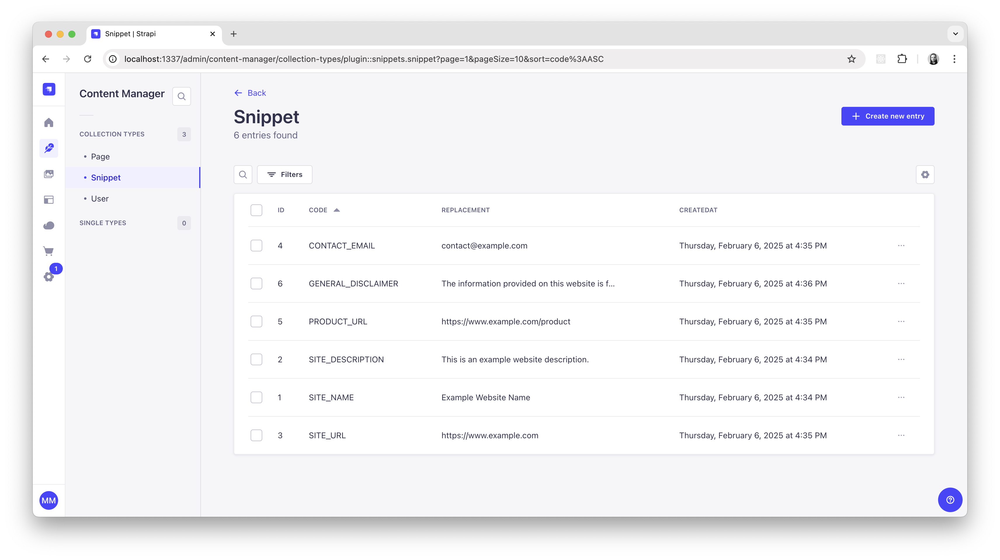
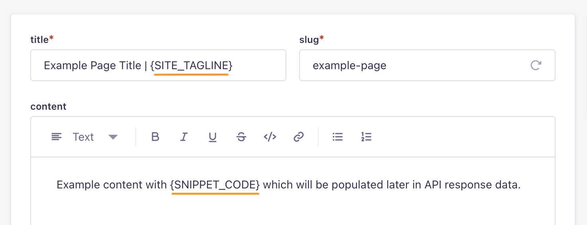

<div align="center">
  
  <h1>Strapi Snippets</h1>
  <p>A plugin for Strapi CMS that populates custom snippets into API response data.</p>
  <p>
    <a href="https://www.npmjs.com/package/strapi-plugin-snippets">
      
    </a>
    <a href="https://strapi.io">
      
    </a>
  </p>
  
</div>

## Get Started

* [Features](#features)
* [Installation](#installation)
* [Compatability](#compatability)
* [Configuration](#configuration)
* [User Guide](#user-guide)
* [Troubleshooting](#troubleshooting)
* [Migration](#migration)
* [Support or Donate](#donate)
* [Roadmap](#roadmap)

## <a id="features"></a>✨ Features
* Create variables to use throughout your content, which are replaced in API response data.
* Copy and paste easily into your text fields.
* Updating the snippet `code` automatically updates all of your data entries in Strapi with the new `code`.
* Supports API models, plugin models, components, and dynamic zones.

## <a id="installation"></a>💎 Installation
```bash
yarn add strapi-plugin-snippets@latest
```

Don't forget to **restart or rebuild** your Strapi app when installing a new plugin.

## <a id="compatability"></a>🔩 Compatibility
| Strapi version | Plugin version |
| - | - |
| v5 | v2 |
| v4 | v1 |

## <a id="configuration"></a>🔧 Configuration
| property | type (default) | description |
| - | - | - |
| contentTypes | object (`null`) | An optional config object that allows configuring which additional models should or should not support snippets. |
| contentTypes.allow | array (`null`) | An array of either model, plugin, or component UIDs which support snippets. |
| contentTypes.deny | array (`null`) | An array of either model, plugin, or component UIDs which DO NOT support snippets. |
| ignoreUnmatched | bool (`false`) | If true, unmatched `codes` will remain unparsed in response data, otherwise they are replaced with an empty string. |
| uppercase | bool (`true`) | If true, the plugin will apply uppercase formatting to the `code` value when a snippet is created or updated. |

### `contentTypes`
By default, all API models and components are parsed by the snippets plugin. However, models defined in plugins are not automatically included.

Use the `allow` and `deny` props of `contentTypes` to include or exclude certain UIDs which can include API content types, plugin content types, and components.

#### Example

```ts
// ./config/plugins.ts`
export default () => ({
  snippets: {
    config: {
      contentTypes: {
        allow: ['plugin::menus.menu', 'plugin::menus.menu-item'],
        deny: ['api::example.example', 'category.example-component'],
      },
    },
  },
});
```
| UID type | Format |
| - | - |
| API model | `api::name.name` |
| Plugin model | `plugin::name.name` |
| Component model | `category.name` |

### `ignoreUnmatched`
If true, unmatched `codes` will remain unparsed in response data, otherwise they are replaced with an empty string.

#### Example

```ts
// ./config/plugins.ts`
export default () => ({
  snippets: {
    config: {
      ignoreUnmatched: false,
    },
  },
});
```

Consider a scenario where we have 2 snippets, one called `SNIPPET_ONE` and another called `SNIPPET_TWO` and both will be replaced with the string "foobar". We also have an entity with a `title` and `summary` fields where both fields use snippets.

The snippet named `SNIPPET_MISSING` does not actually exist and will either be replaced with an empty string or ignored completely. See the example below.

##### Response data BEFORE parsing snippets

```json
{
  "data": {
    "id": 1,
    "title": "Testing snippet {SNIPPET_ONE} and {SNIPPET_MISSING}.",
    "summary": "Testing snippet {SNIPPET_ONE} and {SNIPPET_TWO}."
  },
  "meta": {}
}
```

##### Response with `ignoreUnmatched` set to `true`

```json
{
  "data": {
    "id": 1,
    "title": "Testing snippet foobar and {SNIPPET_MISSING}.",
    "summary": "Testing snippet foobar and foobar."
  },
  "meta": {}
}
```

##### Response with `ignoreUnmatched` set to `false`

```json
{
  "data": {
    "id": 1,
    "title": "Testing snippet foobar and .",
    "summary": "Testing snippet foobar and foobar."
  },
  "meta": {}
}
```

### `uppercase`
If true, the plugin will apply uppercase formatting to the `code` value when a snippet is created or updated. This is also enforced while typing in the `code` input field.

#### Example

```ts
// ./config/plugins.ts`
export default () => ({
  snippets: {
    config: {
      uppercase: false,
    },
  },
});
```

## <a id="user-guide"></a>📘 User Guide

### Creating
While typing the snippet `code` you will notice the input value is masked to the following conditions:

* Must use only letters, numbers, and underscores.
* Must start with a letter.

Uniqueness is validated upon saving.

### Updating
After updating the `code` value of a snippet, it will be automatically updated across your content so you do not have to revisit every entry to update the snippet `code` to the new value.

### Using snippets in your content
To use snippets in your content, you can type a snippet `code` wrapped in curly braces `{}` in string or text fields and it will be replaced with the `replacement` value when it appears in API response data.

<div align="center">
  
</div>

## <a id="troubleshooting"></a>💩 Troubleshooting

#### In general
Remember to **rebuild your app** after making changes to some config or other code.

```bash
yarn build
# OR
yarn develop
```

## <a id="migration"></a>🚌 Migration
Follow the [migration guides](MIGRATION.md) to keep your snippets plugin up-to-date.

## <a id="donate"></a>❤️ Support or Donate
If you are enjoying this plugin and feel extra appreciative, you can [buy me a beer or 3 🍺🍺🍺](https://www.buymeacoffee.com/mattmilburn).

## <a id="roadmap"></a>🚧 Roadmap
* Edit view sidebar button to view and copy/paste snippet codes.
* Reserved snippet codes for things like `CURRENT_YEAR`.
* Localization support.
